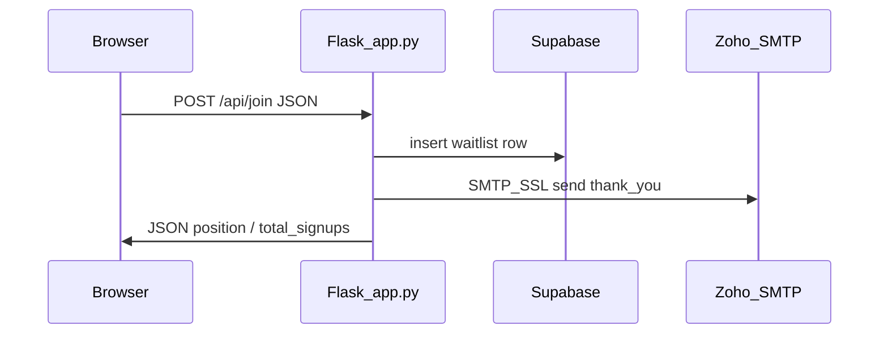

# Petfolio waitlist: Zoho SMTP research + Python refactor plan

## Codebase inventory (all substantive files)

| Path                                                               | Role                                                                                                                    |
| ------------------------------------------------------------------ | ----------------------------------------------------------------------------------------------------------------------- |
| [app.py](app.py)                                                   | Flask app: `/`, `/api/join` (Supabase insert + thank-you email), `/api/stats`, `/todos` test route; Zoho via `SMTP_SSL` |
| [requirements.txt](requirements.txt)                               | **Incomplete**: lists only `Flask==3.0.3` while `app.py` imports `supabase`, `dotenv`, `email_validator`, `jinja2`      |
| [templates/index.html](templates/index.html)                       | Large landing page; waitlist posts JSON to `/api/join`; polls `/api/stats`; exposes `SUPABASE_URL` in client JS         |
| [templates/email/thank_you.html](templates/email/thank_you.html)   | Jinja2 HTML template for welcome email                                                                                  |
| [EMAIL_SETUP.md](EMAIL_SETUP.md), [QUICK_START.md](QUICK_START.md) | **Stale**: describe Resend API keys, not Zoho SMTP                                                                      |
| [README.md](README.md)                                             | Minimal stub                                                                                                            |
| [LICENSE](LICENSE), [index.html.md](index.html.md)                 | Non-runtime                                                                                                             |

**Architecture today**

---

## Online research summary (Zoho Mail + Nodemailer-relevant practices)

Sources: [Zoho SMTP help](https://www.zoho.com/mail/help/zoho-smtp.html), [Zoho rates and limits](https://www.zoho.com/mail/help/adminconsole/rates-and-limits.html), [Nodemailer SMTP transport](https://nodemailer.com/smtp/).

### Zoho SMTP endpoints (must match account type)

- Zoho states the **authoritative** host/port for **your** account appears under **Mail → Settings → Mail Accounts → Server configuration** (datacenter and account type vary).
- **Published defaults:**
  - **Personal `@zohomail.com` and Free Organization accounts**: outgoing `**smtp.zoho.com`**, **465 (SSL)** or **587 (TLS)**.
  - **Paid Organization with domain mailbox (`you@yourdomain.com`)**: `**smtppro.zoho.com`**, same ports.

### Mapping Nodemailer concepts → Python `smtplib` (parity)

| Nodemailer pattern                       | Python equivalent                                               |
| ---------------------------------------- | --------------------------------------------------------------- |
| Port **465**, `secure: true`             | `smtplib.SMTP_SSL(host, 465)` (what you use today)              |
| Port **587**, `secure: false` + STARTTLS | `smtplib.SMTP` + `starttls()` + login                           |
| Auth user = **full mailbox address**     | Same; mismatch causes **Relaying disallowed** per Zoho docs     |
| **App-specific password** when 2FA on    | Use Zoho app password instead of account password               |
| TLS quirks (`rejectUnauthorized`, etc.)  | Python uses system CA bundle; rarely needs extra knobs for Zoho |

### Limits and policy (free / low tiers)

- Outbound limits are described by Zoho as **dynamic hourly ranges** (not a simple fixed “free tier number”); high signup bursts could hit throttling—monitor failures and consider graceful degradation (already partially true).
- Zoho positions the product for normal mailbox use; **bulk/marketing** at scale may violate usage policy—fine for moderate waitlist volume, not for mass campaigns.

### Operational pitfalls (from Zoho troubleshooting)

- **Relaying disallowed**: `From` / SMTP login must match the authenticated mailbox or allowed alias.
- **Wrong SMTP host** for datacenter/account type: client “stops working” until corrected per account UI.
- **Duplicate Sent**: some clients save locally + Zoho saves—Zoho documents disabling “save copy of sent” for SMTP-sent mail if duplicates appear.

### Finding in this repo vs research

- Default host in code is `**smtp.zohomail.com`** ([app.py](app.py) lines 25–26). Official docs emphasize `**smtp.zoho.com**` (free org) or `**smtppro.zoho.com**` (paid org). Treat current default as **high-risk**; replace with `**smtp.zoho.com`** as default **only if** it matches your Zoho “Server configuration” screen (or set explicitly via env with no wrong fallback).

---

## Refactor goals (Python path — confirmed)

1. Align SMTP configuration with **Zoho-documented** patterns and your account’s **exact** server names from the Zoho UI.
2. Bring **dependencies and docs** in sync with reality (Zoho, not Resend).
3. Improve **transactional email quality** (headers, multipart text+HTML) using practices commonly cited alongside Nodemailer setups.
4. Preserve existing API behavior for `[templates/index.html](templates/index.html)` (`/api/join`, `/api/stats`).

---

## Recommended implementation steps

### 1. Fix SMTP configuration surface (`app.py`)

- Change defaults to match Zoho’s published names **after verifying** in Zoho Mail settings:
  - Env-driven `ZOHO_SMTP_HOST` with a safe documented default (e.g. `smtp.zoho.com` for free org) **or** require host in `.env` with no misleading fallback.
- Support **587 + STARTTLS** optionally via env (e.g. `ZOHO_SMTP_USE_TLS=true` → `SMTP` + `starttls()`), mirroring Nodemailer’s common `secure: false` / port 587 setup—helps if SSL paths are blocked on some hosts.
- **Guardrails**: if `ZOHO_MAIL_ADDRESS` or `ZOHO_MAIL_PASSWORD` is missing, skip send with structured logging (avoid accidental relay attempts).

### 2. Email message quality (`send_thank_you_email`)

- Use `**MIMEMultipart("alternative")`** with both **plain text** and **HTML** parts (many clients and spam filters favor multipart/alternative).
- Add useful headers where appropriate:
  - `**Reply-To`** (support inbox).
  - `**List-Unsubscribe**` / `**List-Unsubscribe-Post**` if you implement unsubscribe—template already references `unsubscribe_url`; align header with real behavior when ready.
- Consider `**MIME-Version**` and charset `**UTF-8**` explicitly on parts.
- Replace broad `except Exception` logging with **exception type + message** (and optionally structured logging); keep **non-blocking** behavior relative to signup success.

### 3. Template loading

- Avoid fragile `open('templates/email/thank_you.html')` relative to CWD: use `**Flask.open_resource`** or `pathlib` relative to app root so workers/deploy layouts don’t break.

### 4. Dependencies ([requirements.txt](requirements.txt))

Pin versions for everything imported:

- `Flask`, `supabase`, `python-dotenv`, `email-validator`, `jinja2` (if not relying solely on Flask’s transitive pin).

### 5. Documentation sweep ([EMAIL_SETUP.md](EMAIL_SETUP.md), [QUICK_START.md](QUICK_START.md))

Replace Resend instructions with:

- Zoho SMTP host/port table (personal/free org vs paid org + pointer to EU/IN datacenters if applicable).
- App-specific password / 2FA note.
- Required `.env` keys: `ZOHO_MAIL_ADDRESS`, `ZOHO_MAIL_PASSWORD`, optional host/port/TLS flags.
- Link to official Zoho SMTP + limits pages.

### 6. Security / hygiene (non-email)

- Client exposes `**SUPABASE_URL**` in `[templates/index.html](templates/index.html)`; acceptable only if **anon** key usage stays server-side (currently joins go through Flask—good). Avoid embedding **service role** keys in frontend if introduced later.

### 7. Optional later improvements (out of minimal refactor unless needed)

- **Background send**: thread or task queue so SMTP latency does not add to `/api/join` response time.
- **Rate limiting** on `/api/join` to protect Zoho reputation and reduce abuse.

---

## Verification checklist (after implementation)

- Send test signup with Zoho UI server values from **your** account.
- Confirm received mail renders HTML + shows plain-text fallback.
- Confirm duplicate-email behavior in Sent folder (adjust Zoho setting if needed).
- Simulate missing credentials → signup still succeeds, mail skipped with clear log.

